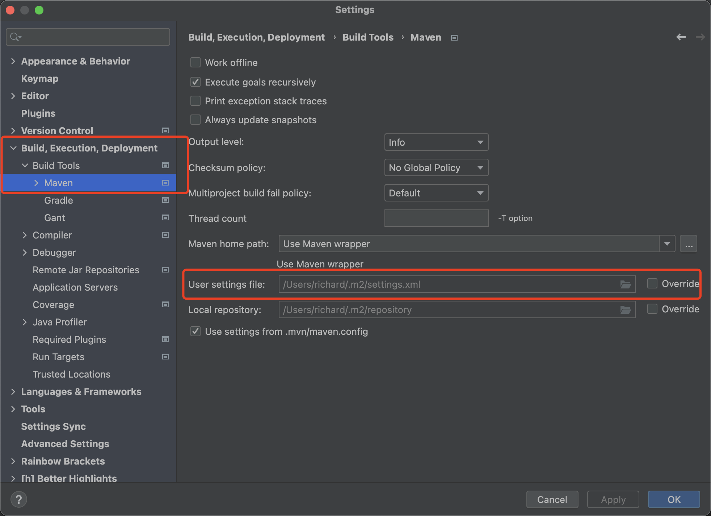
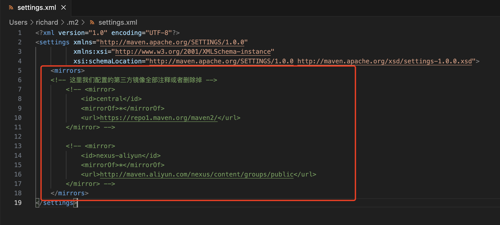

# SpringAi

## 前期准备

1. IDEA版本更新到最新，目前是 2024.1版本
2. 获取你自己的OpenAi key，这里就不多说了可以淘宝购买，也可以自己搞个账户去获取: [OpenAi 官方地址](https://platform.openai.com/playground)
3. 创建SpringBoot项目，SpringBoot版本3.2.4;  
4. jdk 17+
5. 在创建项目的时候勾选SpringWeb和**SpringAi**(在最下面) 


## SpringAi 依赖拉取失败解决方案

如果大家前面都是按照步骤来的但是在拉取spring-ai-openai-spring-boot-starter依赖的时候还是出现问题就说明是我们自己的maven有问题！ 下面是我的解决步骤：

1. 打开IDEA找到“设置setting”

2. 在设置里面找到Build,Excution,Deployment这个选项然后点击进去

3. 上一步进去后再找到Build Tools，然后再点击进去

4. 到这里你就应该能看到Maven了，
      4.1. 点击maven然后右边回出现页面直接看最下面有一个user settings file，这个就是我们maven的配置文件
      4.2. 在你的电脑系统里面找到这个配置文件（我mac是在user/.m2/ 目录下的，windows就大家自己找了）
      4.3**. 然后修改将`<mirror> </mirror>`这里全部注释或者删除，这样就会使 用默认的官方maven取拉取依赖而不是用我们配置的镜像了！！！（这里就是问题的所在，不能用配置的第三方镜像要用它默认的）**
      4.4 刷新maven发现问题解决了 芜湖～ （花费我一个小时才搞出来）






## pom.xml 文件讲解

+ 这里我们不使用正式的0.8.1版本，我们**选择使用1.0.0-SNAPSHOT** 版本，因为这个版本即将发布，且在将来的学习时也不会由于版本的更新而过时。

```xml
<properties>
  <java.version>17</java.version>
  <spring-ai.version>1.0.0-SNAPSHOT</spring-ai.version>
</properties>
```

+ 这里由于Maven官方还没有Spring Ai的依赖，因此我们需要建一个我们自己的仓库，然后去从Spring官方那边去拉取Spring Ai Starter。

```xml
<!-- Spring AI starter has not been added to Maven Central, so we need to add the Spring AI repository -->
<repositories>
  <!-- Repository for Spring AI 1.0.0 snapshot version -->
  <repository>
    <id>spring-snapshot</id>
    <name>Spring snapshots</name>
    <url>https://repo.spring.io/snapshot</url>
    <releases>
      <enabled>false</enabled>
    </releases>
  </repository>
      
  <!-- Repository for Spring AI formal(0.8.1) version -->
  <repository>
    <id>spring-milestones</id>
    <name>Spring Milestones</name>
    <url>https://repo.spring.io/milestone</url>
    <snapshots>
      <enabled>false</enabled>
    </snapshots>
  </repository>
</repositories>
```


## application.yml文件配置

在启动项目之前openai key必须要配置好，不然会报错

```yaml
spring:
  application:
  name: SpringAi
  ai:
    openai:
      # 这里为了安全起见我们的key在idea中用了环境变量去储存！
      api-key: ${My_openAi_Key}
      # 选择我们要用的模型gpt3/gpt4 ...
      engine-id: gpt-3.5-turbo
      # base url
      base-url: https://api.openai.com/
```


## Ai文字聊天

AiChatController: 使用SpringAi为我们注入的 **OpenAiChatClient** 去进行聊天

```java
package com.demo.springai.Controller;

import jakarta.annotation.Resource;
import org.springframework.ai.openai.OpenAiChatClient;
import org.springframework.web.bind.annotation.RequestMapping;
import org.springframework.web.bind.annotation.RequestParam;
import org.springframework.web.bind.annotation.RestController;

/**
 * @Author: Yupeng Li
 * @Date: 10/5/2024 02:02
 * @Description:
 */
@RestController
public class AiChatController {
    @Resource
    private OpenAiChatClient openAiChatClient;
  
  	/**
     * Chat with AI
     * @param message message from user
     * @return response message from AI 
     * we can send a request to http://localhost:8080/chat?msg=hello
     * then we will get a response from AI
     */
    @RequestMapping("/chat")
    public String chat(@RequestParam("msg") String message) {
        String response = openAiChatClient.call(message);
        return response;
    }

}
```


## Ai图片生成

图片生成模型的配置（application.yml）：

```yaml
spring:
  application:
  name: SpringAi
  
  ai:
    openai:
      # your openai key
      api-key: ${My_openAi_Key}
      # base url
      base-url: https://api.openai.com/
      
      # settings for image generation api
        image:
            options:
            model: gpt-4-dalle
            height: 1024
            width: 1024
            quality: hd #the resolution of the image
```


AiImageController: 这里会根据用户的输入要求，返回一个绘制好的图片的URL，我们需要点击这个链接才能看到图片。在实际的应用中我们可能需要对图片做另外的处理，而不是仅仅显示一个链接。

```java
@RestController
public class AiImageController {
  
    @Resource
    private OpenAiImageClient openAiImageClient;

    /**
     * Generate image based on the user input
     * @param message message from user
     * @return image URL
     */
    @RequestMapping("/image")
    public String image(@RequestParam("msg") String message){
        ImageResponse imageResponse = openAiImageClient.call(new ImagePrompt(message));
        System.out.println(imageResponse);

        // 获得图片的URL，点击链接查看图片
        String imageUrl = imageResponse.getResult().getOutput().getUrl();
        //TODO: 对图片进行处理

        return imageUrl;
    }
}
```

