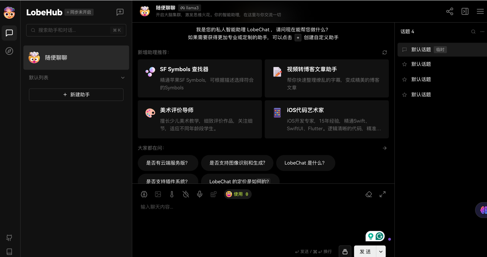

<h1 style="text-align: center;">SpringAi</h1>

## 前期准备

1. IDEA版本更新到最新，目前是 2024.1版本
2. 获取你自己的OpenAi key，这里就不多说了可以淘宝购买，也可以自己搞个账户去获取: [OpenAi 官方地址](https://platform.openai.com/playground)
3. 创建SpringBoot项目，SpringBoot版本3.2.4;  
4. jdk 17+
5. 在创建项目的时候勾选SpringWeb和**SpringAi**(在最下面) 

Reference: [动力节点SpringAi视频课程](https://www.bilibili.com/video/BV1d1421d7Fy?p=1&vd_source=8e2358f9b27440129acde1350d40c3cb)

## SpringAi 依赖拉取失败解决方案

如果大家前面都是按照步骤来的但是在拉取spring-ai-openai-spring-boot-starter依赖的时候还是出现问题就说明是我们自己的maven有问题！ 下面是我的解决步骤：

1. 打开IDEA找到“设置setting”

2. 在设置里面找到Build,Excution,Deployment这个选项然后点击进去

3. 上一步进去后再找到Build Tools，然后再点击进去

4. 到这里你就应该能看到Maven了，
      4.1. 点击maven然后右边回出现页面直接看最下面有一个user settings file，这个就是我们maven的配置文件
      4.2. 在你的电脑系统里面找到这个配置文件（我mac是在user/.m2/ 目录下的，windows就大家自己找了）
      4.3**. 然后修改将`<mirror> </mirror>`这里全部注释或者删除，这样就会使 用默认的官方maven取拉取依赖而不是用我们配置的镜像了！！！（这里就是问题的所在，不能用配置的第三方镜像要用它默认的）**
      4.4 刷新maven发现问题解决了 芜湖～ （花费我一个小时才搞出来）


## pom.xml 文件讲解

+ 这里我们不使用正式的0.8.1版本，我们**选择使用1.0.0-SNAPSHOT** 版本，因为这个版本即将发布，且在将来的学习时也不会由于版本的更新而过时。

```xml
<properties>
  <java.version>17</java.version>
  <spring-ai.version>1.0.0-SNAPSHOT</spring-ai.version>
</properties>
```

+ 这里由于Maven官方还没有Spring Ai的依赖，因此我们需要建一个我们自己的仓库，然后去从Spring官方那边去拉取Spring Ai Starter。

```xml
<!-- Spring AI starter has not been added to Maven Central, so we need to add the Spring AI repository -->
<repositories>
  <!-- Repository for Spring AI 1.0.0 snapshot version -->
  <repository>
    <id>spring-snapshot</id>
    <name>Spring snapshots</name>
    <url>https://repo.spring.io/snapshot</url>
    <releases>
      <enabled>false</enabled>
    </releases>
  </repository>
      
  <!-- Repository for Spring AI formal(0.8.1) version -->
  <repository>
    <id>spring-milestones</id>
    <name>Spring Milestones</name>
    <url>https://repo.spring.io/milestone</url>
    <snapshots>
      <enabled>false</enabled>
    </snapshots>
  </repository>
</repositories>
```


## application.yml文件配置

在启动项目之前openai key必须要配置好，不然会报错

```yaml
spring:
  application:
  name: SpringAi
  ai:
    openai:
      # 这里为了安全起见我们的key在idea中用了环境变量去储存！
      api-key: ${My_openAi_Key}
      # 选择我们要用的模型gpt3/gpt4 ...
      engine-id: gpt-3.5-turbo
      # base url
      base-url: https://api.openai.com/
```


## Ai文字聊天

AiChatController: 使用SpringAi为我们注入的 **OpenAiChatClient** 去进行聊天

```java
package com.demo.springai.Controller;

import jakarta.annotation.Resource;
import org.springframework.ai.openai.OpenAiChatClient;
import org.springframework.web.bind.annotation.RequestMapping;
import org.springframework.web.bind.annotation.RequestParam;
import org.springframework.web.bind.annotation.RestController;

/**
 * @Author: Yupeng Li
 * @Date: 10/5/2024 02:02
 * @Description:
 */
@RestController
public class AiChatController {
    @Resource
    private OpenAiChatClient openAiChatClient;
  
  	/**
     * Chat with AI
     * @param message message from user
     * @return response message from AI 
     * we can send a request to http://localhost:8080/chat?msg=hello
     * then we will get a response from AI
     */
    @RequestMapping("/chat")
    public String chat(@RequestParam("msg") String message) {
        String response = openAiChatClient.call(message);
        return response;
    }

}
```


## Ai图片生成

图片生成模型的配置（application.yml）：

```yaml
spring:
  application:
  name: SpringAi
  
  ai:
    openai:
      # your openai key
      api-key: ${My_openAi_Key}
      # base url
      base-url: https://api.openai.com/
      
      # settings for image generation api
        image:
            options:
            model: gpt-4-dalle
            height: 1024
            width: 1024
            quality: hd #the resolution of the image
```


AiImageController: 这里会根据用户的输入要求，返回一个绘制好的图片的URL，我们需要点击这个链接才能看到图片。在实际的应用中我们可能需要对图片做另外的处理，而不是仅仅显示一个链接。

```java
@RestController
public class AiImageController {
  
    @Resource
    private OpenAiImageClient openAiImageClient;

    /**
     * Generate image based on the user input
     * @param message message from user
     * @return image URL
     */
    @RequestMapping("/image")
    public String image(@RequestParam("msg") String message){
        ImageResponse imageResponse = openAiImageClient.call(new ImagePrompt(message));
        System.out.println(imageResponse);

        // 获得图片的URL，点击链接查看图片
        String imageUrl = imageResponse.getResult().getOutput().getUrl();
        //TODO: 对图片进行处理

        return imageUrl;
    }
}
```


## Ai音频转文字

这里就没有写配置了，直接使用api默认调用的audio-to-text 模型。

```java
@RestController
public class AiTranscriptionController {

    @Resource
    private OpenAiAudioTranscriptionClient openAiAudioTranscriptionClient;

    /**
     * Transcribe audio to text
     * @param audioUrl audio URL from user
     * @return transcript text from audio
     */
    @RequestMapping("/transcription")
    public Object transcription(@RequestParam("url") String audioUrl) {
        if (Objects.isNull(audioUrl)) {
            return "Please provide audio URL";
        }
        // 获取音频作为资源，然后传给OpenAiAudioTranscriptionClient 进行转换
        // 这里是获取的本地音频文件(FileSystemResource)，后期可以改成从网络获取或者class path获取
        org.springframework.core.io.Resource audioFile = new FileSystemResource(audioUrl);

        // 获取音频转换后的文本
        String transcriptText = openAiAudioTranscriptionClient.call(audioFile);
        return transcriptText;
    }
}
```


## Ai文字转音频

跟之前的请求一样这里还是根据用户输入的文字然后通过openai的OpenAiAudioSpeechClient去转换成音频文件。

但是这里需要注意的是最终返回的结果是一个byte[]数组，并不是一个直接的音频文件，因为我们还需要自己编写一个工具类去吧byte[]数组写成文件的格式然后保存起来。

```java
@RestController
public class AiTranscriptionController {

    @Resource
    private OpenAiAudioSpeechClient openAiAudioSpeechClient;

    /**
     * Convert text to speech
     * @param message message from user
     * @return text to speech successfully
     * @throws IOException if I/O error occurs
     * 文本转换成MP3格式的音频保存在audio文件夹下
     */
    @RequestMapping("/speech")
    public Object speech(@RequestParam("msg") String message) throws IOException {
        if (Objects.isNull(message)) {
            return "Please provide message";
        }

        // 文字转语音，返回的是字节数组!
        byte[] audio = openAiAudioSpeechClient.call(message);

        // 通过工具类把字节数组转成音频文件，保存到audio文件夹下
        try {
            FileUtil.writeBytesToMp3File("audio", audio);
        } catch (IOException e) {
            throw new RuntimeException(e);
        }

        return "Text to speech successfully!";
    }
}
```

工具类FileUtil：

```java
public class FileUtil {
    /**
     * 将字节数组写入到指定路径的 .mp3 文件中，确保文件名不重复
     *
     * @param directory 目标目录路径
     * @param data      字节数组数据
     * @return 生成的文件名
     * @throws IOException 如果发生 I/O 错误
     */
    public static String writeBytesToMp3File(String directory, byte[] data) throws IOException {
        String fileName = generateUniqueFileName(directory, "mp3");
        FileOutputStream fos = null;
        try {
            fos = new FileOutputStream(new File(directory, fileName));
            fos.write(data);
        } finally {
            if (fos != null) {
                try {
                    fos.close();
                } catch (IOException e) {
                    e.printStackTrace();
                }
            }
        }
        return fileName;
    }

    /**
     * 生成唯一的文件名
     *
     * @param directory 目标目录路径
     * @param extension 文件扩展名
     * @return 唯一的文件名
     */
    private static String generateUniqueFileName(String directory, String extension) {
        String timeStamp = new SimpleDateFormat("yyyyMMdd_HHmmss").format(new Date());
        String uniqueID = UUID.randomUUID().toString().substring(0, 8);
        String fileName = "audio_" + timeStamp + "_" + uniqueID + "." + extension;

        File file = new File(directory, fileName);
        while (file.exists()) {
            uniqueID = UUID.randomUUID().toString().substring(0, 8);
            fileName = "audio_" + timeStamp + "_" + uniqueID + "." + extension;
            file = new File(directory, fileName);
        }
        return fileName;
    }

}
```


## SpringAi多模态

前面我们都是每个功能对应一个API比如chat api我只能聊天，image api我只能生成图片，这些就被称为**单模态API**。那么有没有一种API就是我**既可以让AI跟我聊天也可以让它给我生成图片，同时还是让他给我做翻译**的功能呢？这就是我们这里所要介绍的**多模态API了**！

```java
@RestController
public class Multimodality {
  
    @Resource
    private ChatClient chatClient;

    /**
     * Multimodality
     * @param message message from user
     * @param imageUrl image URL from user
     * @return response message from AI
     * 根据用户输入的文本和图片生成回复：
     * http://localhost:8080/multimodality?msg=描述这个图片并且用英文翻译给我&&url=https://encrypted-tbn0.gstatic.com/images?q=tbn:ANd9GcR9FUOcSsrbLPB9Sx5skzfzWuy-Cdjj6Wo0z4fWbxlyIqp7uN0SQdojaZY7dqTd97qPZQ&usqp=CAU
     */
    @RequestMapping("/multimodality")
    public Object multimodality(@RequestParam("msg") String message, @RequestParam("url") String imageUrl) {
        UserMessage userMessage = new UserMessage(message,
                List.of(new Media(MimeTypeUtils.IMAGE_PNG, imageUrl))
        );

        //基础调用方式
        //chatClient.call(userMessage);

        //通过Prompt的方式调用，可以指定模型，这里指定为GPT-4 Vision Preview
        ChatResponse response = chatClient.call(new Prompt(userMessage, OpenAiChatOptions.builder()
                .withModel(OpenAiApi.ChatModel.GPT_4_VISION_PREVIEW.getValue())
                .build())
        );

        // 返回AI的回复
        return response.getResult().getOutput().getContent();
    }
  
}
```


## Ollama本地模型部署

除了使用OpenAi的API去进行ai的对话方式外，我们也可以通过在本地部署开源模型，这样就不需要api key和网络也可以使用Ai模型去对话了。

这里我们借助Ollama平台去一键获取和在本地部署模型

1. 下载Ollama： [Ollama](https://ollama.com/download/)

2. [在这里](https://ollama.com/library)选择我们想要的模型，这里我就选择llama3模型大概4GB, 然后在终端根据指令 `ollama run llama3` 进行安装

3. 模型拉取完成后我们就可以跟AI进行对话了，注意这里模型部署可能会需要一定的CPU和GPU一不小心电脑内存就裂开了🤣


## SpringAi-Ollama

上面我们部署好了本地模型之后我们就可以去通过SpringAi去集成了，我重新创建了一个项目然后压缩成了SpringAI-Ollama.**zip**文件，可以单独下载这个zip文件然后跑起来去测试。

1. 跟之前创建SpringBoot项目，但是这里要注意在最后选择SpringAi的时候**要选择Ollama而不是之前的OpenAi了**
2. 项目创建好了之后，我们可以吧之前的pom.xml文件给直接复制过来，继续使用SpringAi 1.0.0-SNAPSHOT版本。

**这里有一个非常重要的点我们的starter需要改变不再是SpringAi starter了而是下面的spring-ai-ollama-start：**

```xml
<dependency>
	<groupId>org.springframework.ai</groupId>
	<artifactId>spring-ai-ollama-spring-boot-starter</artifactId></dependency>
```

3. 修改我们的application.yml文件：

   + 将之前的openai改为ollama

   + base_url改为ollama运行的本地端口11414

   + 指定chat模型，目前我们只部署了llama3模型所以只能指定这个模型

application.yml:

```yaml
spring:
  application:
    name: SpringAI-Ollama

  ai:
    ollama:
      # 这里是默认的ollama运行端口
      base-url: http://localhost:11434
      chat:
        # 这里是指定我们在ollama中所存在的模型，我们目前只下载了llama3这个模型
        model: llama3
```


Controller:

```java
@RestController
public class OllamaController {

    @Resource
    private OllamaChatClient ollamaChatClient;

    @RequestMapping("/ollama")
    public String ollama(@RequestParam("msg") String message) {
        String response = ollamaChatClient.call(message);
        return response;
    }

}
```

这里我测试这个controller的时候电脑内存直接飙升跑满了，我只有8GB的内存太卡啦🤣


停止运行Ollama(Mac)：如果有ui application直接点击quit就行，不然可以用cmd，如下：

**找到**的进程：

```bash
ps aux | grep ollama
```

**终止**进程：

```bash
kill -9 <PID>
```


## Open WebUI

Open WebUI 比较成熟流行的UI界面这里是他们的[GitHub安装教程](https://github.com/open-webui/open-webui)，但是感觉没有Lobe的看起来舒服好用。这里我就不用这个了，感兴趣的自己可以去GitHub看看。  


## Lobe Chat

这个新的UI看起来内容丰富一点，还支持中文，[GitHub官方教程](https://github.com/lobehub/lobe-chat)。

1. 在你的电脑上下载Docker
2. 运行指令：(可能遇到换行符\没用的情况，就手动改成一行去掉换行符就行 )

```dockerfile
$ docker run -d -p 3210:3210 \ 
  -e OPENAI_API_KEY=sk-xxxx \
  -e OPENAI_PROXY_URL=https://api-proxy.com/v1 \
  -e ACCESS_CODE=lobe66 \
  --name lobe-chat \
  lobehub/lobe-chat
```

```dockerfile
docker run -d -p 3210:3210 -e OPENAI_API_KEY=sk-xxxx -e OPENAI_PROXY_URL=https://api-proxy.com/v1 -e ACCESS_CODE=lobe66 --name lobe-chat lobehub/lobe-chat
```

解释：

```dockerfile
-d # 后台运行
-p 3210:3210 #把主机(本机)端口和docker容器端口映射
-e OPENAI_API_KEY=sk-xxxx # 环境变量openAi key 可以先不设置随便写
-e OPENAI_PROXY_URL=https://api-proxy.com/v1  # 代理端口如果用VPN的话要配置
-e ACCESS_CODE=lobe66 # 环境变量随便写个
--name lobe-chat #容器起个名字
lobehub/lobe-chat #镜像名字 不能错
```

3. 运行完毕后直接访问`localhost:3210` 就直接进入聊天界面了（第一次安装可能会花点时间拉取镜像）


**注意：**

+ 在选取本地模型的时候**确保你的Ollama是处于运行中**的，如果没运行会报错。

+ 如果Ollama运行中但是所选取的模型没有本地部署Lobe chat会自动提示你下载。

+ 如果选取OpenAi的GPT模型也会弹出提示，输入我们的API key就行了。


聊天界面：


